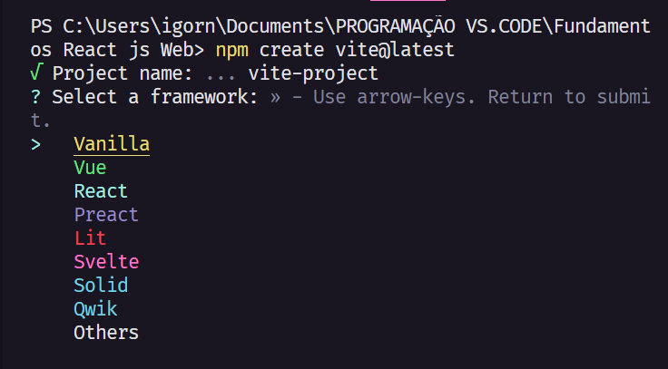
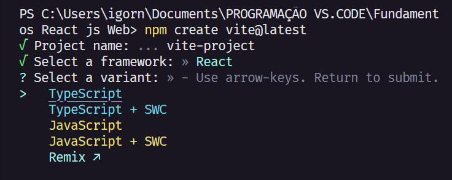
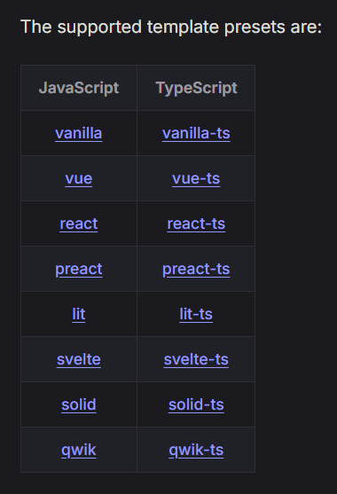

# Fundamentos React.js

São projeto feito por um ***iniciante/intermediario*** em programação com total intuito de aprender a tecnologia React.js:

<div align="center" style="display: inline_block">


</div>

<br>

O comando para iniciar o projeto ***React.Js + ViteJs*** para fazer a interface da Apliacao. 

```javascript
npm create vite@latest
```

Tipos de projetos que vc pode fazer usando o ***ViteJs*** quando coloca no terminal...
<br>

<div align="center" style="display: inline_block">

</div>

<br>

Pode tambem fazer um projeto com Variação usando ***TypeScript*** e outros...

<br>

<div align="center" style="display: inline_block">

</div>

<br>

Todos os projetos podem ser feitos com o uso do TypeScript 

<br>

<div align="center" style="display: inline_block">

</div>

<br>

## Style para Componentes 

para fazer a estilizacao é necessario fazer algumas coisa como umas o CSS modelo que ja vem incluso no Vite.js para codar em JavaScript por padrao e usar o poder do CSS nos componentes 

<div align="center">
<a href="https://github.com/css-modules/css-modules">
<picture>
  <source media="(prefers-color-scheme: dark)" srcset="https://github.com/css-modules/css-modules/assets/9113740/f0de16c6-aee2-4fb7-8752-bf400cc5145e">
  <source media="(prefers-color-scheme: light)" srcset="https://raw.githubusercontent.com/css-modules/logos/master/css-modules-logo.png">
  
</picture>
</a>
<a href="https://www.styled-components.com">
    
</a>
</div>

<br>

dependendo do qu vc preferir todos os dois sao uteis para estilizacao de paginas Web para qualquer projeto que seja construido em grupo ou de forma pessoal.
